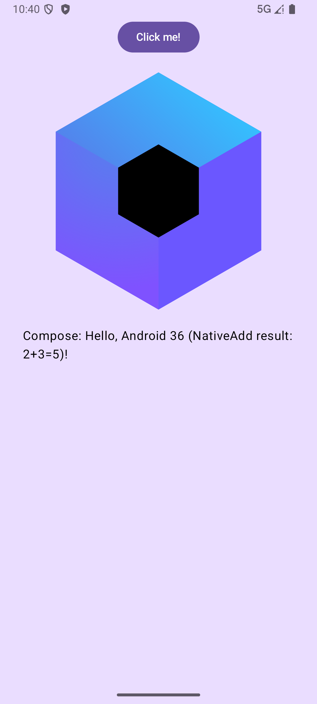
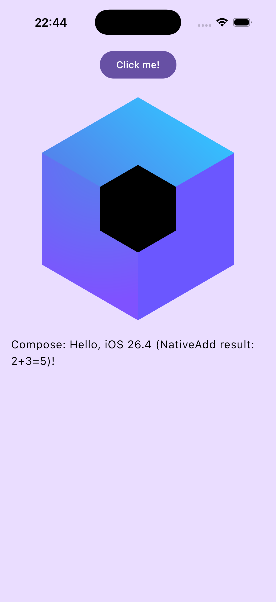
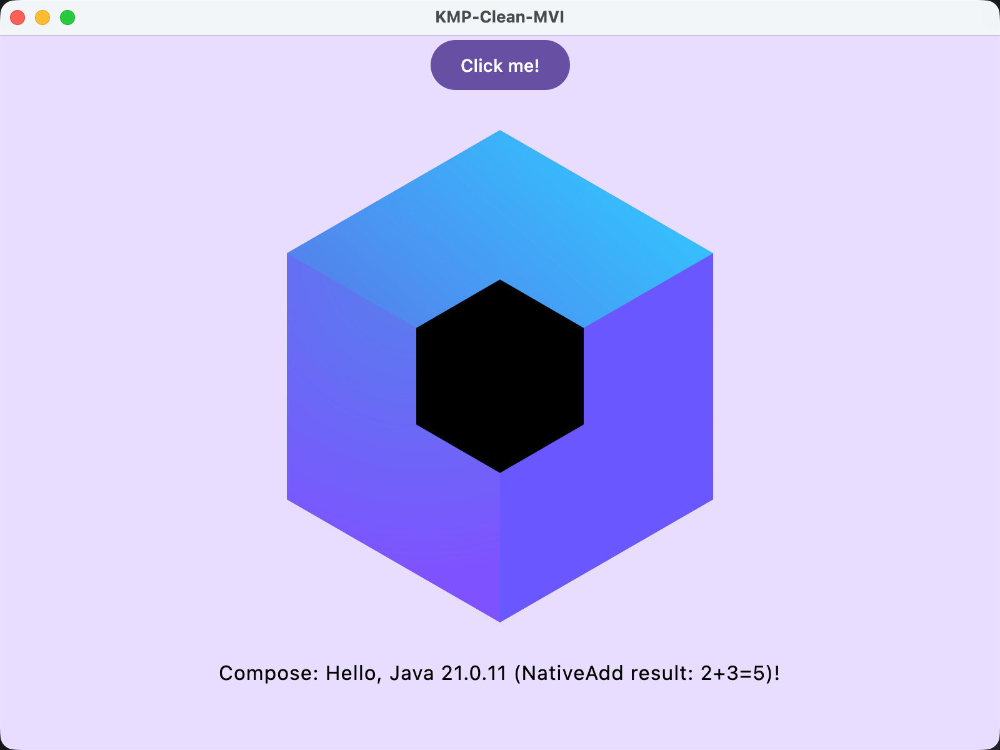
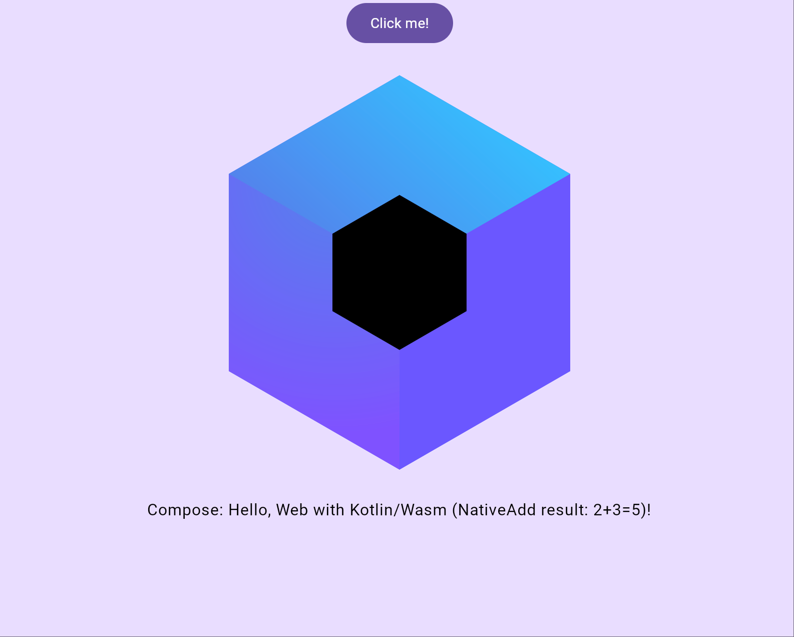

# KMP-Clean-MVI

A full-stack Kotlin Multiplatform (KMP) project demonstrating **Clean Architecture** and **MVI (Model-View-Intent)** pattern across Android, iOS, Web (Wasm/JS), Desktop, and Server.

## 📸 Screenshots

<p align="center">
  
  
  
</p>
<p align="center">
  
</p>

## 🚀 Project Structure

*   **[:app:shared](./app/shared)**: Shared UI logic using **Compose Multiplatform**. Contains common UI components and screen logic.
*   **[:core](./core)**: Pure Kotlin logic shared across **all** targets, including the backend. Ideal for data models, business rules, and validation.
*   **[:server](./server)**: Backend service powered by **Ktor**. Provides APIs and handles server-side logic.
*   **[:app:androidApp](./app/androidApp)**: Android-specific entry point and configuration.
*   **[:app:iosApp](./app/iosApp)**: iOS Xcode project and SwiftUI entry point.
*   **[:app:webApp](./app/webApp)**: Web implementation supporting both WasmJs and JS.
*   **[:app:desktopApp](./app/desktopApp)**: Desktop application entry point for JVM.

## 🛠 Tech Stack

*   **UI**: Compose Multiplatform (Android, iOS, Desktop, Web)
*   **Networking**: Ktor Client (Shared)
*   **Backend**: Ktor Server
*   **Architecture**: Clean Architecture + MVI
*   **Language**: 100% Kotlin
*   **Native**: CInterop (iOS), JNI (Android/Desktop), JS Interop (Web)

## 🏗 Native Integration

The project demonstrates calling a shared C library (`simple_math.c`) across all platforms:

| Platform | Technology | Implementation Detail |
| :--- | :--- | :--- |
| **iOS** | **CInterop** | Links C static library (`.a`) into the Kotlin/Native framework. |
| **Android** | **JNI (NDK)** | Uses NDK Clang to compile `.so` library, loaded via `System.loadLibrary`. |
| **Desktop** | **JNI (JVM)** | Loads macOS `.dylib` dynamically at runtime. |
| **Web** | **JS Interop** | Utilizes JavaScript engine for low-level execution. |

A master script `compile_native.sh` is provided to compile all native components in one go.

## 🏃 Running the apps

### 🌍 Backend (Server)
```bash
./gradlew :server:run
```
*The server runs on `http://localhost:8081` by default.*

### 📱 Android
```bash
./gradlew :app:androidApp:installDebug
```

### 🍎 iOS
1. Open `app/iosApp/iosApp.xcodeproj` in Xcode.
2. Select a simulator and press **Cmd + R**.

### 💻 Desktop
```bash
./gradlew :app:desktopApp:run
```

### 🌐 Web (Wasm)
```bash
./gradlew :app:webApp:wasmJsBrowserDevelopmentRun
```

## 🧪 Running Tests
*   Android: `./gradlew :app:shared:testAndroidHostTest`
*   Desktop: `./gradlew :app:shared:jvmTest`
*   Server: `./gradlew :server:test`
*   iOS: `./gradlew :app:shared:iosSimulatorArm64Test`

---
This project is based on the JetBrains KMP Template.
Learn more about [Kotlin Multiplatform](https://www.jetbrains.com/help/kotlin-multiplatform-dev/get-started.html) and [Compose Multiplatform](https://github.com/JetBrains/compose-multiplatform).
